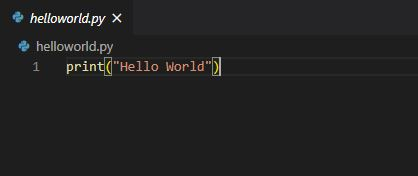
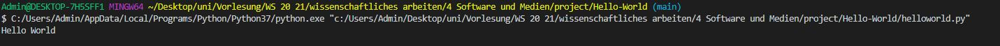

# Hello-World
This repository contains the code for a Hello-World-Program
This program prints "Hello World" in the console.

# Requirements
To run this program you need Python, a Python Interpreter and preferably an IDE which can run a Python file

# Installation
Open helloworld.py with your preferred IDE and run the program

